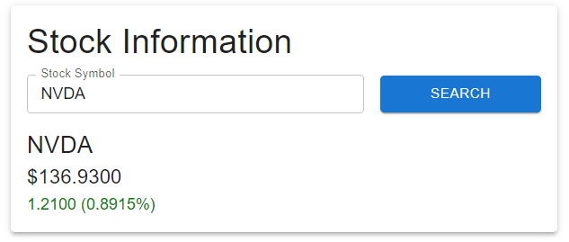

# alpha-vantage-api-react-sample

This code was written to easily explore what an AlphaVantage React app could look like. It was built in 30 minutes :)



### Development

To install dependencies:

```bash
bun install
```

To run:

```bash
bun run index.ts
```

### Deployment

The code is automatically deployed by a GH action. Note that the repository needs to contain the `VITE_ALPHA_VANTAGE_API_KEY` environment key set to allow the code to build properly


### Bun is cool 😎

This project was created using `bun init` in bun v1.1.13. [Bun](https://bun.sh) is a fast all-in-one JavaScript runtime.
